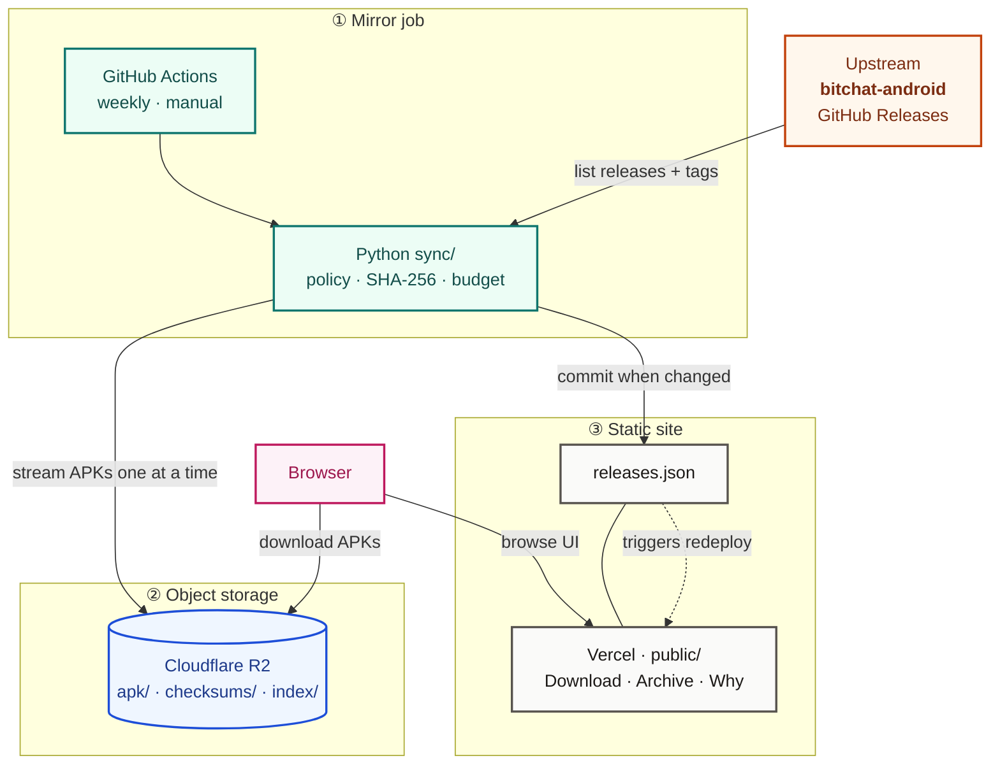

<div align="center">
  

  <h1>bitchat-mirror</h1>

  <p>
    Unofficial mirror of
    <a href="https://github.com/permissionlesstech/bitchat-android">bitchat-android</a>
    APKs.
  </p>
</div>

<br>

<div align="center">

> the government of india does not like technologies like bitchat and wants it taken down
>
> — jack (@jack) <a href="https://x.com/jack/status/2080565084586135773">July 24, 2026</a>


</div>

<br>

When install paths get pulled offline, the binaries still need somewhere to live. This repo keeps them on Cloudflare R2 and serves a static download site on Vercel — no app server, no database, no serverless functions. Browsers fetch APKs straight from R2.

bitchat is **GPLv3**. Every mirrored release carries its upstream tag and commit SHA so corresponding source stays findable. This project is **not affiliated** with upstream.

---

## How it works



| Piece | Job |
|---|---|
| **GitHub Actions** | Weekly cron + manual sync |
| **Cloudflare R2** | Holds APKs (free-tier budget, ~9.5 GiB) |
| **Vercel** | Hosts the static UI only |

---

## Setup

Needs **Python 3.11+** (3.12 recommended).

```bash
git clone git@github.com:CodeDotJS/bitchat-mirror.git
cd bitchat-mirror

python3 -m venv .venv
source .venv/bin/activate
pip install -r requirements.txt

cp .env.example .env
```

Fill `.env` as needed:

| Variable | When |
|---|---|
| `GITHUB_TOKEN` | Local dry-runs / sync — anonymous GitHub is 60 req/h |
| `R2_ACCOUNT_ID` / `R2_ACCESS_KEY_ID` / `R2_SECRET_ACCESS_KEY` / `R2_BUCKET` / `R2_PUBLIC_BASE` | Live uploads only |

Dry-run (no uploads):

```bash
./sync.sh --dry-run
./sync.sh --dry-run --write-index   # also refresh public/releases.json for UI preview
```

Live sync:

```bash
./sync.sh --release 1.7.4   # one tag first
./sync.sh                   # full smart policy
```

Preview the site:

```bash
cd public && python3 -m http.server 8877
# http://127.0.0.1:8877/
```

Check the install:

```bash
pytest
```

Inside Cursor’s terminal, prefer `./sync.sh` over bare `python -m sync.main` — Cursor’s AppImage can shadow the venv and break imports like `boto3`.

---

## License

Upstream: [permissionlesstech/bitchat-android](https://github.com/permissionlesstech/bitchat-android) · **GPLv3**

Redistributing binaries obliges a clear path to corresponding source — that is the point of free software, and of this mirror.
